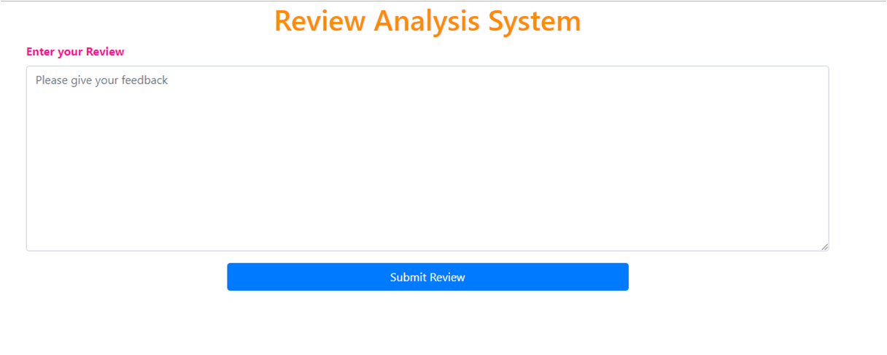
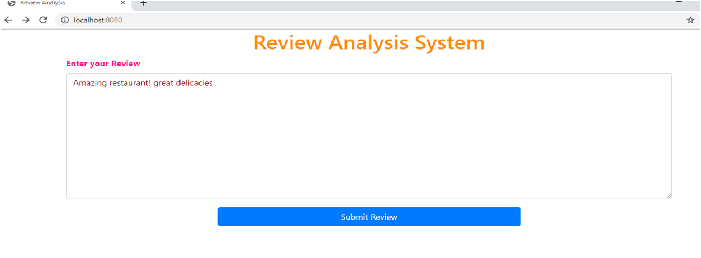
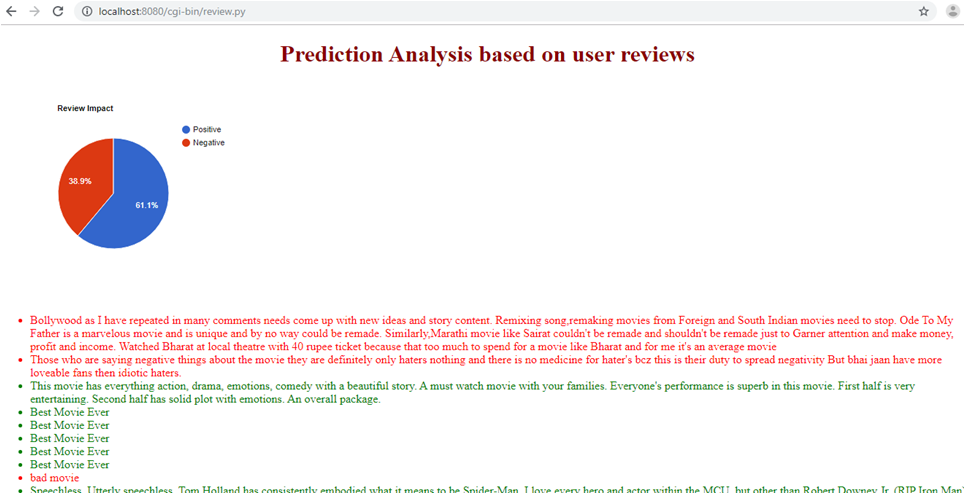

# Review-Analysis
Review analysis model is basic model which can provide insights by automatically analyzing product reviews and separating them into tags: <b>Positive, Neutral, Negative</b> using text classification and natural language processing.
By using *sentiment analysis*to structure product , you can:
  
•	Understand what your customers like and dislike about your product.

•	Compare your product reviews with those of your competitors.

•	Get the latest product insights in real-time, 24/7.

•	Save hundreds of hours of manual data processing.

#### Frontend: Html Css

#### Language used: Python

#### Tools and technologies:
Jupyter Notebook

VISUAL STUDIO CODE

NLTK

### Training data collected from IMDb , Yelp and Amazon

# Working:

User inputs a review and applying sentiment logistics it is predicted that review is negative or positive and graphical analysis is done and determined what percent of reviews are positive and what percent are negative.
<b>*The project will be executed on remote server i.e localhost and integration will be done on vscode terminal.*</b>

# Snapshots:
 
 

 
 

 
 

